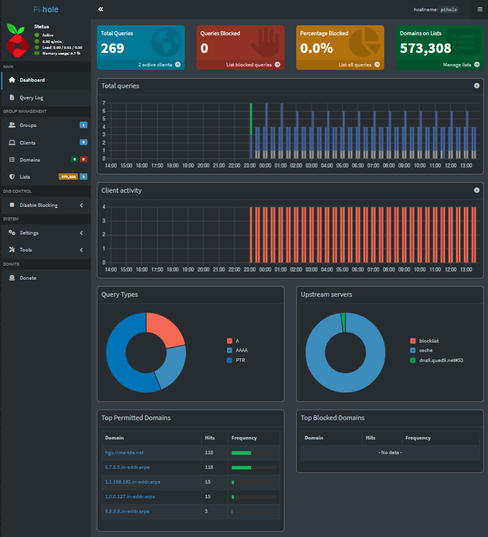
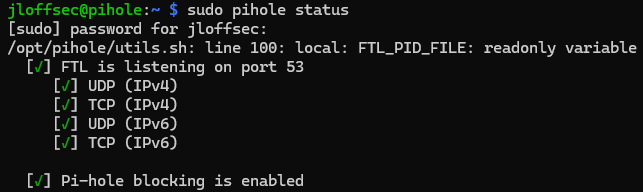

Documentación del proceso de instalación y configuración de Pi-hole como bloqueador de anuncios y DNS a nivel de red.

**Hardware:** Raspberry Pi 3B+  
**OS:** Raspberry Pi OS Lite (64-bit)  
**Pi-hole version:** 6.4.2
**Fecha:** Mayo 2026

---

## Índice

1. [[README#Qué es Pi-hole | Qué es Pi-Hole]]
2. [[README#Requisitos previos | Requisitos previos]]
3. [[README#Preparación de la Raspberry Pi | Preparación de la Raspberry Pi]]
4. [[README#Instalación de Pi-hole | Instalación de Pi-hole]]
5. [[README#Configuración del router | Configuración del router]]
6. [[README#Panel de administración | Panel de administración]]
7. [[README#Listas de bloqueo recomendadas | Listas de bloqueo recomendadas]]
8. [[README#Verificación | Verificación]]
9. [[README#Comandos útiles | Comandos útiles]]
10. [[README#Problemas conocidos | Problemas conocidos]]

---

## Qué es Pi-hole

Pi-hole es un servidor DNS local que actúa como bloqueador de anuncios de red (_network-wide ad blocker_). Cuando un dispositivo de la red intenta resolver un dominio incluido en las listas de bloqueo, Pi-hole responde con una dirección nula en lugar de la real, impidiendo que el contenido se cargue. Esto afecta a todos los dispositivos de la red sin necesidad de instalar nada en cada uno.

---

## Requisitos previos

- Raspberry Pi 3B+ con tarjeta microSD
- Raspberry Pi OS Lite instalado (sin escritorio)
- Conexión Wi-Fi (o por cable)
- IP estática asignada a la Raspberry Pi
- Acceso SSH habilitado

---

## Preparación de la Raspberry Pi

### 1. Flashear la imagen

[Raspberry Pi Imager](https://www.raspberrypi.com/software/) para flashear **Raspberry Pi OS Lite (64-bit)** en la microSD.

**Device**: Raspberry Pi 3b+ en mi caso.

**OS**: Raspberry Pi Others > Raspberry Pi OS Lite (64-bit)

**Storage**: SDXC Card montada, en F:\ en mi caso

**Customization**:
- Hostname = pihole
- Localization = Madrid (Spain)
- User = jloffsec
	  *password*
- Wi-Fi = (Conectamos al Wi-Fi)
- Remote access = Activamos SSH

Pulsar WRITE y una vez instalado expulsar la tarjeta SD y conectar a la Raspberry Pi. 
Iniciar Raspberry Pi 3b+. 
### 2. Conectar y acceder por SSH

```bash
ssh jloffsec@pihole.local
# o con la IP directa si el hostname no resuelve
ssh jloffsec@192.168.1.150
```

### 3. Actualizar el sistema

```bash
sudo apt update && sudo apt upgrade -y
```

### 4. Asignar IP estática

Editar configuración de red:

```bash
sudo nano /etc/dhcpcd.conf
```

Añadir al final del archivo:

```
# Configuración IP estática

interface eth0
static ip_address=192.168.1.150/24
static routers=192.168.1.1
static domain_name_servers=127.0.0.1 9.9.9.9
```

Reiniciar para aplicar:

```bash
sudo reboot
```

---

## Instalación de Pi-hole

```bash
curl -sSL https://install.pi-hole.net | bash
```

El instalador es interactivo. Seleccionar opciones durante la instalación:

| Opción                        | Valor elegido     |
| ----------------------------- | ----------------- |
| Interfaz de red               | `eth0`            |
| Upstream DNS                  | Quad9 (`9.9.9.9`) |
| Listas de bloqueo por defecto | Sí                |
| Admin web interface           | Sí                |
| lighttpd web server           | Sí                |
| Log queries                   | Sí                |
| Privacy mode                  | 0 (mostrar todo)  |
*Elijo el servidor DNS público Quad9 con la opción filtered para bloquear sitios maliciosos que compara con una base de datos en tiempo real mientras que Pi-hole se encarga de bloquear anuncios y rastreadores.*

*Elijo Query login > Show Everything para que el proceso interno de Pi-hole (Faster Than Light), que actúa como servidor DNS y motor de estadísticas, registre todo y se muestre en el panel web.*

Al finalizar, el instalador muestra la contraseña del panel web. Guardar o cambiar:

```bash
# http://pi.hole:80/admin
# http://192.168.1.150/admin

pihole setpassword <nueva_contraseña>
```

---

### Configuración del router

Para que Pi-hole filtre el tráfico de toda la red, el router debe entregar la IP de la Raspberry Pi como servidor DNS a todos los dispositivos por DHCP.

En la interfaz del router:

1. Ir a la sección DHCP / LAN
2. En "DNS primario" poner la IP de la Raspberry Pi: `192.168.1.150` 
3. En "DNS secundario" poner un DNS externo como fallback: `9.9.9.9` 
4. Guardar y reiniciar router

> Con DNS secundario configurado, si Pi-hole cae, los dispositivos siguen resolviendo dominios (sin bloqueo). 
> *No poner DNS secundario para que Pi-hole sea obligatorio.

---

### Panel de administración

Accesible desde cualquier dispositivo de la red:

```
http://192.168.1.150/admin
# o
http://pihole/admin
```


Desde el panel se puede:

- Ver estadísticas de consultas en tiempo real
- Añadir dominios a la lista de bloqueo 
- Gestionar listas de bloqueo
- Revisar el log de consultas

---

### Listas de bloqueo recomendadas

Añadir en **Admin > Lists > Add blocklist**:

| Lista               | URL                                                                            |
| ------------------- | ------------------------------------------------------------------------------ |
| StevenBlack Unified | `https://raw.githubusercontent.com/StevenBlack/hosts/master/hosts`             |
| OISD                | `https://big.oisd.nl`                                                          |
| HaGeZi Pro          | `https://raw.githubusercontent.com/hagezi/dns-blocklists/main/adblock/pro.txt` |

Después actualizar las bases de datos:

```bash
pihole -g
```

---

## Verificación

### Comprobar que Pi-hole está activo

```bash
pihole status
```


### Verificar que el DNS funciona desde otro dispositivo

```bash
# En Windows
nslookup google.com 192.168.1.150

# En Linux/macOS
dig @192.168.1.150 google.com
```

### Verificar que el bloqueo funciona

```bash
dig @192.168.1.150 doubleclick.net
# Debe devolver 0.0.0.0
```

---

## Comandos útiles

```bash
# Estado del servicio
pihole status

# Actualizar Pi-hole
pihole -up

# Actualizar listas de bloqueo
pihole -g

# Ver el log en tiempo real
pihole -t

# Habilitar / deshabilitar temporalmente (en segundos)
pihole disable 300
pihole enable

# Cambiar contraseña del panel
pihole setpassword new_password
```


---

## Problemas conocidos

### DNS secundario en el router evita que el bloqueo sea completo

Si el dispositivo usa el DNS secundario directamente, Pi-hole no interviene. Solución: no configurar DNS secundario en el router, o forzar el DNS a nivel de cada dispositivo.

### Pi-hole no arranca tras reinicio

Verificar que el servicio está habilitado:

```bash
sudo systemctl enable pihole-FTL
sudo systemctl start pihole-FTL
```

---

## Recursos

- [Documentación oficial Pi-hole](https://docs.pi-hole.net/)
- [Repositorio Pi-hole](https://github.com/pi-hole/pi-hole)
- [Listado de listas - firebog.net](https://firebog.net/)
- [Repositorio HaGeZi blocklists](https://github.com/hagezi/dns-blocklists)
